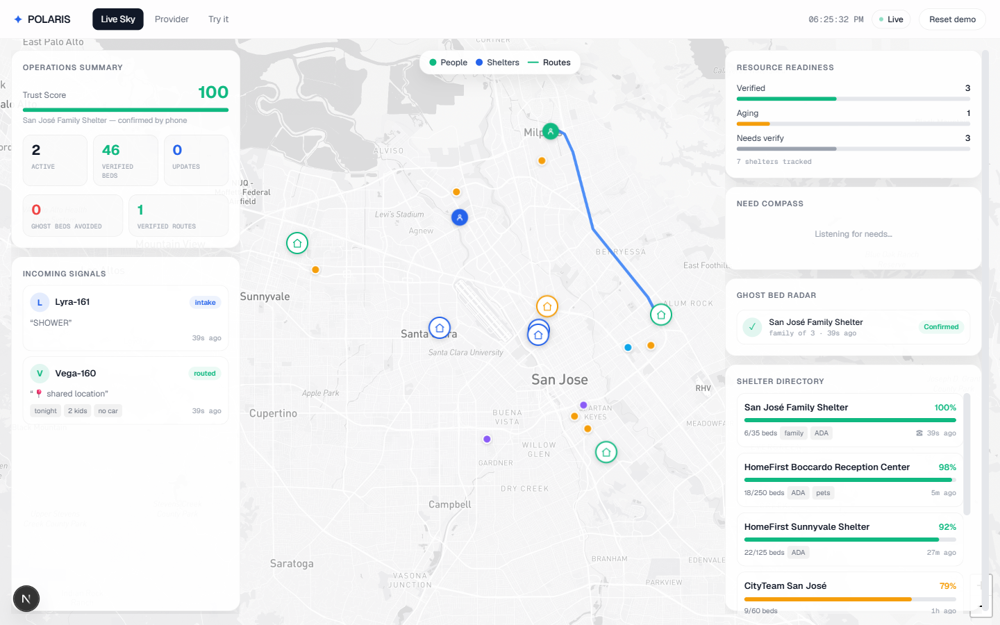

# Polaris

**Polaris kills ghost beds by verifying shelter availability before sending someone across town.**

A voice/SMS-first housing navigator for people experiencing housing insecurity — no app, no data plan, no smartphone required. Polaris understands a person's situation in plain language, ranks eligible shelters with a real scoring algorithm, then **places a live phone call to confirm a real bed** before routing anyone. A "ghost bed" is a listing that says *open* but is actually *full*; Polaris refuses to send someone to one.

> Built for **Milpitas Hacks 2 · Track 2 — Housing Dignity**.



---

## Why this exists

People without stable housing often have no smartphone and no data — but they have a phone that can text or call. Existing shelter lists are stale: someone takes a two-hour bus trip across town to a shelter that filled up hours ago, and now the bed at the place they *didn't* go to is gone too. **Dignity is being told the truth.** Polaris's entire contribution is a live verification layer so that "open" actually means open.

## The demo flow

1. A person texts: *"I need somewhere to sleep tonight. I have my 2 kids and no car."*
2. Polaris extracts the real constraints (urgency, family size, ADA, transportation) and asks for a ZIP if missing.
3. They reply `95035`.
4. Polaris ranks eligible shelters — hard filters (family, gender, accessibility, open-now) then a weighted score (proximity, freshness, availability, reachable-before-intake-closes).
5. The top match is stale, so the **Ghost Bed Radar** places a call: *"Press 1 if you have a family bed tonight."* The shelter presses **1**.
6. Only now does Polaris route them: *"✅ Confirmed 12s ago: San José Family Shelter has space tonight for 1 adult + 2 children. Intake closes 9 PM. ~18 min by transit. Reply CALL and I'll let them know you're coming."*
7. The **Live Sky** dashboard shows the whole loop in real time.

## Architecture

```
  SMS / Voice ──▶ Twilio ──▶ /api/sms ──▶ orchestrator ──▶ matcher ──▶ ranked shelters
                                              │                          │
                                              │ (top match is stale)     │
                                              ▼                          │
                                       /api/verify/call ◀── Twilio ◀──────┘
                                       (DTMF: press 1 / 2)
                                              │
                                       /api/verify/callback ──▶ updates trust, texts the person
                                              │
                              ┌───────────────┴───────────────┐
                          Redis or in-memory store            │
                                              │                ▼
                                      /api/dashboard ──▶ Live Sky (polls every 2s)
```

**The split that matters:** Polaris *owns* the routing logic (the part that must be correct and defensible); the AI layer only renders language.

| You author & defend | Provided by infra |
|---|---|
| `lib/matcher.ts` — eligibility filters + weighted scoring (unit-tested) | Twilio — the phone number + DTMF voice |
| `lib/orchestrator.ts` — conversation state machine | Upstash Redis (optional) — shared state on Vercel |
| `lib/verify.ts` — the outbound verification call engine | Next.js / Vercel — hosting |
| `lib/constraints.ts` — EN/ES need extraction (unit-tested) | |

Replies are **deterministic templates** (`lib/ai.ts`), bilingual EN/ES — chosen on purpose: SMS copy to someone in crisis must be calm and predictable, never a model surprise. The **Backboard LLM** (`lib/backboard.ts`, the event sponsor's API) enriches *constraint extraction* for free-form phrasings the regexes miss, but the deterministic extractor stays authoritative and a slow/failed call silently falls back — so the demo never depends on an external model call. Set `BACKBOARD_API_KEY` to enable it.

## Tech stack

- **Next.js 16** (App Router) + **React 19** + **TypeScript** + **Tailwind v4**
- **Twilio** for SMS + outbound voice (TwiML, keypad/DTMF)
- **Upstash Redis** (optional, via Vercel Marketplace) for shared state — falls back to an in-memory store with zero config
- **Vitest** for the matcher + copy tests

## Project structure

```
app/
  page.tsx              landing
  dashboard/page.tsx    the Live Sky mission-control board (polls /api/dashboard)
  provider/page.tsx     Provider Beacon — shelters report their own availability
  api/
    sms/                Twilio inbound SMS webhook (also accepts JSON for testing)
    verify/call/        TwiML the shelter hears (the keypad question)
    verify/callback/    DTMF result -> updates trust, texts the person
    dashboard/          read endpoint the board polls
    provider/update/    beacon updates
    reset/              re-seed for a fresh demo run
lib/
  matcher.ts            ⭐ eligibility filters + Polaris Score (the owned core)
  orchestrator.ts       conversation state machine
  verify.ts             Ghost Bed Radar engine
  constraints.ts        EN/ES constraint extraction
  ai.ts                 bilingual reply composition
  store.ts              in-memory + Redis state
  resources.ts          seed resource data (real SCC orgs, illustrative availability)
  geo.ts                ZIP centroids, distance, transit/drive ETA
```

## Run it locally

```bash
npm install
npm run dev          # http://localhost:3000
npm test             # 20 unit tests
npm run typecheck
```

With no environment variables set, Polaris runs fully on an in-memory store and **simulates** Twilio sends (logged, not transmitted) — so you can drive the entire flow without an account. Test it via JSON:

```bash
# 1) intake
curl -s localhost:3000/api/sms -H 'content-type: application/json' \
  -d '{"from":"+14085551234","body":"need a bed tonight, my 2 kids, no car"}'
# 2) provide ZIP -> kicks off a verification call
curl -s localhost:3000/api/sms -H 'content-type: application/json' \
  -d '{"from":"+14085551234","body":"95035"}'
# 3) find the verification id on /dashboard, then simulate the shelter pressing 1:
#    GET /api/verify/callback?vid=<id>&Digits=1
```

Watch `/dashboard` update live. `/provider` lets you push availability beacons.

## Going live with Twilio

1. Create a Twilio account and buy/claim a number (trial works — trial can only text/call **verified** numbers, so verify the demo phones first).
2. Set the env vars below in `.env.local`.
3. Point the number's **Messaging webhook** at `https://<your-domain>/api/sms` (HTTP POST).
4. For local development, expose your dev server with a tunnel (e.g. `ngrok http 3000`) and set `PUBLIC_BASE_URL` to the tunnel URL so Twilio can fetch the verification TwiML.
5. Set `DEMO_SHELTER_PHONE` to a pre-verified phone — that's who receives the "press 1" verification call during the demo (so you don't call real shelters).

## Environment variables

See `.env.example`. All optional for local simulation; required for live telephony.

| Var | Purpose |
|---|---|
| `TWILIO_ACCOUNT_SID` / `TWILIO_AUTH_TOKEN` / `TWILIO_FROM_NUMBER` | Send SMS + place calls |
| `PUBLIC_BASE_URL` | Public origin Twilio fetches for TwiML/callbacks (tunnel or Vercel URL) |
| `DEMO_SHELTER_PHONE` | Pre-verified phone that receives the verification call in demos |
| `NEXT_PUBLIC_POLARIS_NUMBER` | The number shown on the landing page |
| `BACKBOARD_API_KEY` (+ `BACKBOARD_PROVIDER`/`BACKBOARD_MODEL`) | Optional — enriches constraint extraction via Backboard's LLM API |
| `UPSTASH_REDIS_REST_URL` / `UPSTASH_REDIS_REST_TOKEN` | Optional shared state for multi-instance Vercel (also accepts `KV_REST_API_*`) |

## Deploying to Vercel

Push the repo and import it, or run `vercel`. Add the env vars in project settings. For a deployed demo, add an **Upstash Redis** integration from the Vercel Marketplace so dashboard state is consistent across serverless instances (the in-memory store only shares within one warm instance).

## The matcher (the defensible core)

`lib/matcher.ts` is two clearly separated stages:

1. **Hard eligibility filters** — a failed filter removes the resource entirely. Sending a family to a men-only shelter, or someone in a wheelchair to a place with stairs, is worse than returning nothing.
2. **Weighted score (0–100)** — `0.30·proximity + 0.30·freshness + 0.15·availability + 0.25·reachability`. Freshness is an exponential decay on how long ago availability was verified (never-verified seed data sits low, so it always wants re-verification). Reachability tanks an option you physically cannot reach before intake closes — the exact "ghost trip" Polaris exists to prevent.

Every result carries human-readable `reasons[]`, which is what the SMS reply and dashboard cards render. It's pure and `now`-injected, so it's fully unit-tested.

## Safety & privacy

- **Crisis detection** — messages signalling self-harm halt resource-matching and route to **988**, in English or Spanish.
- **No PII by default** — people are identified only by phone and shown on the board as a star name (e.g. *Vega-481*). No legal name, no SSN.

## Roadmap (intentionally out of scope for the MVP)

Inbound voice IVR, benefits eligibility screener, document concierge, warm-transfer bridging, mutual-aid matching, callback-on-availability.

---

*Resource availability shown is illustrative seed data for demonstration; Polaris verifies live before routing anyone. Real Santa Clara County organizations are referenced for relevance.*
